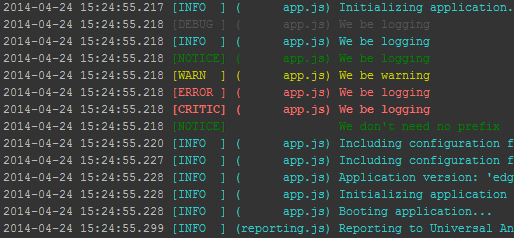

fm-log
======

What?
-----
Straight-forward logging module. Lines up everything in nice columns. Uses colors. Sends everything straight to `console.log`, no events, no `nextTick()`.

	var log = require( "fm-log" ).module( path.basename( __filename ) );
	log.info( "Initializing application..." );
	  
	log.debug( "We be logging" );
	log.info( "We be logging" );
	log.notice( "We be logging" );
	log.warn( "We be warning" );
	log.error( "We be logging" );
	log.critical( "We be logging" );
	
	var generic = require( "fm-log" );
	generic.notice( "We don't need no prefix" );

How?
----

Put this in every file where you want to log:

    var log = require( "fm-log" ).module( path.basename( __filename ) );

Then just use `log.info` or one of the other logging levels shown above.

For loggers without a specific prefix, just `require()` the module and use it directly:

	var generic = require( "fm-log" );
	generic.notice( "We don't need no prefix" );